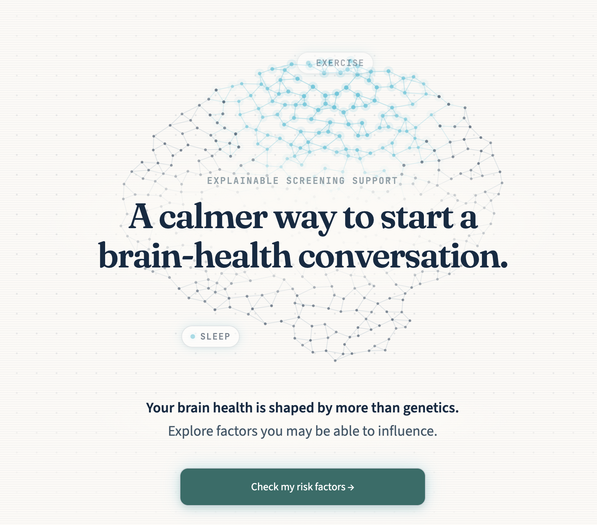
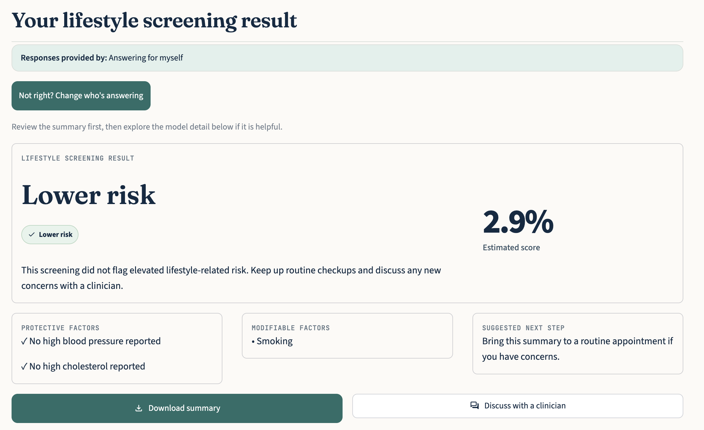
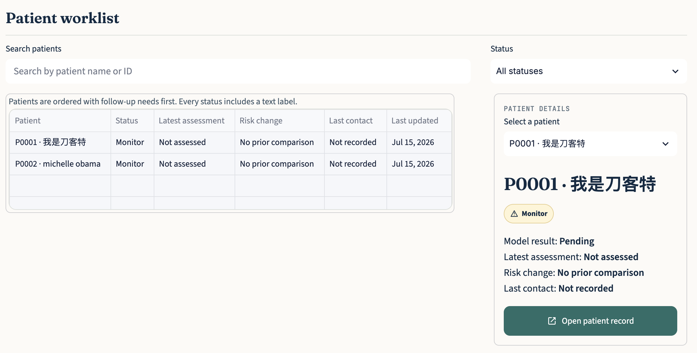

# Project.AI
GCET Dementia Project

**[Try BrainGuard AI here](https://brain-guard-ai.streamlit.app/)**

# Overview

BrainGuard AI is an educational and clinical decision-support prototype. It uses machine learning models trained on research datasets to estimate dementia-related risk from lifestyle, cognitive, and structural (MRI-derived) factors, and to explain which factors influenced each estimate. It is **not** a diagnosis, a medical device, or a replacement for professional medical evaluation — model associations do not establish causation, and results should always be discussed with a qualified healthcare provider.

According to research, about 40% of dementia cases could have been prevented or slowed by modifying lifestyle factors, meaning that changes in small, everyday habits can meaningfully affect long-term risk. BrainGuard AI aims to support that conversation — surfacing modifiable, model-associated factors and personalized, explainable estimates so patients and clinicians can decide next steps together. It does not itself prevent, diagnose, or treat dementia.

# Disclaimer

BrainGuard AI is an educational and clinical decision-support prototype, not a diagnosis, a certified medical device, or a substitute for professional medical evaluation. Model outputs are statistical associations learned from limited research datasets, not proof of cause and effect. A **Low Risk** result does not rule out dementia, and a **High Risk** result does not mean a person has or will develop dementia. What-if comparisons illustrate model behavior only — they do not prove that making a given change would cause the displayed reduction for a real person. If you or someone you know has concerns about memory, thinking, or daily functioning, please consult a qualified physician.

# Features

* **Patient Portal** — quick self-service dementia risk check, patient registration, and an AI assistant for questions about results.
* **Clinic Portal** (clinician login required) — dashboard of registered patients, patient history with CSV batch import, a two-tab (lifestyle + structural/clinical) dementia risk check, SHAP-driven explanations and personalized action plans, and downloadable PDF medical reports.
* Risk predictions from trained XGBoost models with SHAP explainability, plus transparent validation performance (cross-validated AUC/accuracy) for each model.

# Authors

Olivia Wang, Grade 11 (Class of 2028), International Community School, Redmond, WA -- Project Liason

David Chen, Grade 11 (Class of 2028), Tabor Academy, Marion, MA -- Backend Developer

Emma Liu, Grade 11 (Class of 2028), Shanghai American School Pudong Campus -- Frontend Developer

Yuki Mach Grade 11 (class of 2028), Intfernational school in Hawaii, Hauula -- UI/UX

# 📸 Application Screenshots

## Welcome Page

<p align="center">
  
</p>

---

## Patient Risk Assessment

<p align="center">
  
</p>

---

## Clinician Dashboard

<p align="center">
  
</p>


# Requirements

* Python 3.12
* Dependencies listed in [requirements.txt](requirements.txt) (Streamlit, XGBoost, scikit-learn, SHAP, pandas, plotly, matplotlib, fpdf2, qrcode, openai)
* An OpenAI API key if you want the AI Assistant / chatbot features to work — the rest of the app runs fine without one.

# Quick Start

```bash
# 1. Install dependencies
pip install -r requirements.txt

# 2. (Optional) enable the AI assistant by setting an OpenAI API key
#    either as an environment variable...
export OPENAI_API_KEY=sk-...
#    ...or in .streamlit/secrets.toml
echo 'OPENAI_API_KEY = "sk-..."' > .streamlit/secrets.toml

# 3. Run the app
streamlit run app.py
```

The app opens at `http://localhost:8501`. `database.db` (SQLite) is created automatically on first run. From the welcome screen, choose **Patient** or **Clinic** — clinicians register their own account on first login, there are no seeded demo credentials.

To run the test suite:

```bash
pytest tests/ -v
```

# File Structure

```
app.py                  # entry point: role routing, session state, navigation
views/                  # one file per page (patient portal, clinic portal, login, etc.)
utils/                  # shared logic: db access, auth, PDF reports, charts, chatbot
src/                    # data cleaning and prediction pipelines for the ML models
models/                 # trained model artifacts (.pkl), SHAP explainers, metrics
data/                   # sample/reference datasets for patient and clinician views
tests/                  # pytest suite (auth, predictions, chatbot)
.streamlit/config.toml  # theme configuration
```

# Notes

